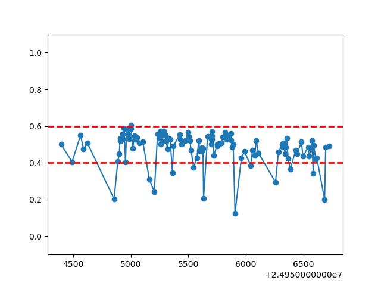
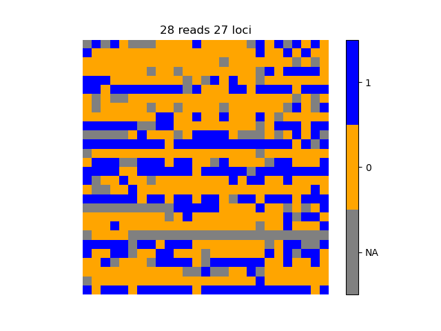
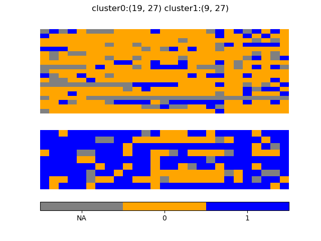

ASMS
====


# Installation

1. `git clone  git@github.com:ecmra/asms.git`
2. install rust following https://www.rust-lang.org/tools/install

(this typically boils down to 

`curl --proto '=https' --tlsv1.2 -sSf https://sh.rustup.rs | sh`

)

3. `cd asms`

4. `cargo build -r`

the executable is in `asms/target/release/asms`


# Introduction


`asms` scans mapped reads from diploid genomes  searching for allele specific methylation, 
with the help of known genetic variants or simply by looking at methylation patterns. 
Reads must contain methylation information encoded with MM/ML tags
(see [SAM tags sepc]()).
An `asms` workflow starts by  selecting a number of regions at intermediate methylation values,
then it tries to cluster the reads on those loci in two groups based on the methylation
patterns appearing on the reads themselves.

`asms` has 4 subcommands: `scan`,  `cluster`, `filter` and `scan-vcf`.

# A simple worflow example

## Selecting interesting regions with `scan`

```
asms scan [--nadj][--merge_distance][--region] <file.bed.gz> <outdir>
```

where `file.bed.gz` is a 
[bedmthyl](<https://www.encodeproject.org/data-standards/wgbs/>) 
file compressed with `bgzip`  and indexed with `tabix` (hence there
will be a file of the form `<file.bed.gz.tbi>` in the same directory).
The `bedmethylfile` shoud not contain strand-spefific information; eg
if creating it with modkit, use the `--combine-strands` option; likewise,
the file should only contain information about methylated CpGs.
Loci which are not related to 5mC modifications are skipped; loci where the strand
is not `.` or `+` are also skipped.

The output will be in the file `<outdir>/merged-im.bed`; `<outdir>`
might contain other temporary files useful for debugging or more in depth analysis.

`<outdir>/merged-im.bed` has 5 columns; the first three are the coordinates for 
an intermediate methylation region, followed by its length and the number of CpGs
it contains. Fig.\ref{intermediate} shows a typical output, in this case part of an
imprinting control region on chr15.




### OPTIONS

`--nadj`               `<integer>`           there must be at least `nadj` adjacent CpGs with 
                                                intermediate methylation to call a region.

`--merge_distance`   `<integer>`           regions will be merged if they are closer than
                                               the merge distance.

`--region`             `<chr:start-stop>`     perform the scan only in the specified genomic stretch.      


## cluster

After generating a list of intermediate regions, one can cluster the reads mapping on 
them using

```
asms cluster <bedfn> <bamfn> <reference> <outdir> 
```

the command line arguments are as follows:

where  `<bedfn>`  is a BED files containing regions for the clustering algorithm to work on
(typically `merged-im.bed`). `<bamfn>` is the alignment file (BAM/CRAM);
`<reference>` is and  indexed FASTA reference and 
the `<outdir>`  directory which will contain the clustering results.
If alignments are contained in a `CRAM` file the reference must correspond to the one
used in creating the `CRAM`.

`asms cluster` will create 3 subdirectories of `outdir` called
`outdir/matrices`, `outdir/clusters` and `outdir/stats` 
plus a file in `outdir/` called `stats-summary.txt` which 
contain descriptive statistics for each locus which has been clustered.


## filter

After clustering the last step is listing the putative allele specific methylation regions.
the command line is:

`asm <bedfn> <outdir>` where `<bedfn>` typically has been created by a previous `asms scan` command
(which by default writes `merged-im.bed`) and   `<outdir>` contains the `stats` subdirectory written by
`asms cluster`.
the output of asm is in `<outdir>/asm.bed` 

This is a `BED9` file with the following header:
`chrom  chromStart      chromEnd        name    score(nCpG)     pop0    pop1    m0      m1`

where `pop0, pop1` is the size of the two clusters of reads and `m0,m1` is the median methylation
in the two clusters. The `score(nCpg)` column counts the number of CpGs in each ASM region.


See figure\ref{asm} for an example of methylation values in selected ASM regions.


## scan-vcf

checks a list of known variants (in a `.vcf` file) and prints out a region surronding
SNPs falling in a locus where methylation is intermediate.
Regions obtained in this way can be used for clustering and asm-calling.


# More details on the subcommands

Bot `scan` and `scan-vcf`  have a `--region` option which restricts the analysis
to a specific genome stretch.
The subcommand `cluster` does not output on `stdout` as it needs typically to write multiple
files (_eg_ there is one matrix and one cluster per entry in the list of regions contained in a `bed` file).
Similarly for `scan` which generates 2 files inside `outdir`.
The subcommand `scan-vcf` writes to `stdout`.


# Scripts for plotting the results

There are 2 python scripts in the `src/` directory (or bundled with the binary) which can be used 
to plot the results of `asms`.
Examples of a binarized matrix (fig.\ref{matrix}) and its corresponding clusters (fig.\ref{clusters}) 
are shown below.

 

 


# Alternatives and limitations

It is possible to find allele specific methylation by phasing the reads and looking
at differences in methylation across haplotypes. `asms` helps in those case where phasing
is not practical (_eg_ because too expensive, or in regions withouth enough density of
heterozygous variants).

# Contact

github issues and/or pull requests. email to emanuele dot raineri at cnag dot eu

