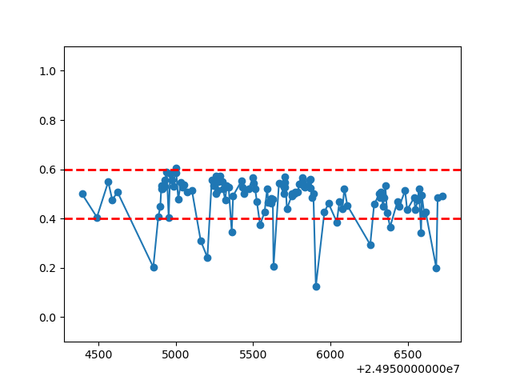
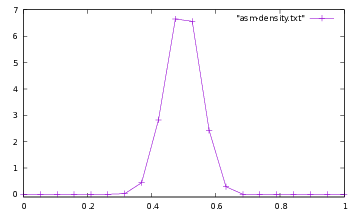
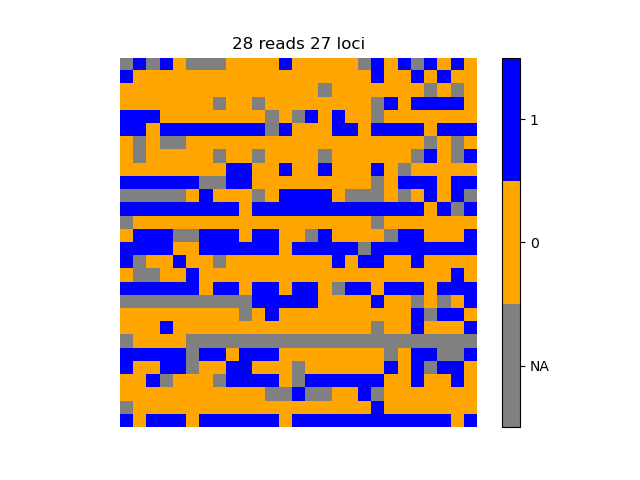
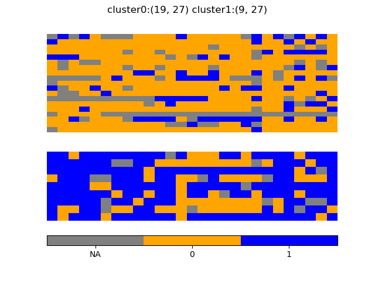

ASMS
====


# Installation

1. `git clone  git@github.com:ecmra/asms.git`
2. install rust as explained in https://www.rust-lang.org/tools/install
3. `cd asms`
4. `cargo build -r`

the executable is in `asms/target/release/asms`


# Introduction


`asms` scans mapped reads from diploid genomes  searching for allele specific methylation, 
with the help of known genetic variants or simply by looking at methylation patterns. 
Reads must contain methylation information encoded with MM/ML tags
(see [SAM tags spec](https://samtools.github.io/hts-specs/SAMtags.pdf)).
An `asms` workflow starts by  selecting a number of regions at intermediate methylation values,
followed by clustering the reads on those loci in two groups based on the methylation
patterns appearing on the reads themselves.

`asms` has 5 sub-commands: `scan`,  `cluster`, `filter`, `scan-vcf` and `cluster-by-snp`.

# A simple workflow example

## Selecting interesting regions with `scan`

```
asms scan [--nadj][--merge_distance][--region][--lower-bound][--upper-bound] <file.bed.gz> <outdir>
```

where `file.bed.gz` is a 
[bedmethyl](<https://www.encodeproject.org/data-standards/wgbs/>) 
file compressed with `bgzip`  and indexed with `tabix` (hence there
will be a file of the form `<file.bed.gz.tbi>` in the same directory).
The `bedmethyl` file should not contain strand-specific information; _eg_
if creating it with modkit, use the `--combine-strands` option; likewise,
the file should only contain information about methylated CpGs.
Loci which are not related to 5mC modifications are skipped; loci where the strand
is not `.` or `+` are also skipped.

The output will be in the file `<outdir>/merged-im.bed`; `<outdir>`
might contain other temporary files useful for debugging or more in depth analysis.

`<outdir>/merged-im.bed` has 5 columns; the first three are the coordinates for 
an intermediate methylation region, followed by its length and the number of CpGs
it contains. The figure below shows a typical output, in this case part of an
imprinting control region on chr15.




```
OPTIONS:
--lower-bound    <float in [0,1] default=0.4>
--upper-bound    <float in [0,1] default=0.6>
                 intermediate regions are defined as having methylation
                 between lower bound and upper bound.
--merge-distance <DISTANCE(bp)>
                 merge intermediate regions at less then this distance
                 (default=1000)
--nadj           <NCPGS>
                 minimum number of adjacent CpGs with intermediate methylation
                 to call an intermediate region.
                 (default=3)
--region         <CONTIG:NUM-NUM>
                 only look at specific region 
```


## cluster

The clustering algorithm in `asms` tries to subdivide reads in 2
groups depending on their methylation content.

After generating a list of intermediate regions, one can cluster the reads 
mapping on them using

```
asms cluster [--seed][--maxit] <bedfn> <bamfn> <reference> <outdir> 
```

the command line arguments are as follows:

where  `<bedfn>`  is a BED files containing regions for the clustering algorithm to work on
(typically `merged-im.bed`). `<bamfn>` is the BAM/CRAM alignment file ;
`<reference>` is and  indexed FASTA reference and 
the `<outdir>`  directory which will contain the clustering results.
If alignments are contained in a `CRAM` file the reference must correspond to the one
used in creating the `CRAM`.

`asms cluster` will create 3 sub-directories of `outdir` called
`outdir/matrices`, `outdir/clusters` and `outdir/stats` ; it will also create a file in `outdir/` called `stats-summary.bed` which 
contain descriptive statistics for each locus which has been clustered.

```
OPTIONS:
--seed           <u64>
                 seed for the random number generator 
                 (to initialize clustering)

--maxit          <u16>
                 max number of EM iterations (default=10)
```

## filter

After clustering the last step is listing the putative allele specific methylation regions.
the command line is:

`asms filter <outdir>` where    `<outdir>` contains the `stats` subdirectory written by
`asms cluster` and the `merged-im.bed` file created by `asms scan`.
`filter` writes to `<outdir>/asm.bed` , which is a `BED9` file with the following header:
`chrom  chromStart      chromEnd        name    score(nCpG)     pop0    pop1    m0      m1`

where `pop0, pop1` are the sizes of the two clusters of reads and `m0,m1` are the median methylation values
in the two clusters. The `score(nCpg)` column counts the number of CpGs in each ASM region.


This figure below represents methylation values in some ASM regions found by
`asms filter`.




## scan-vcf


`scan-vcf [--lower-bound][--upper-bound][--region] <vcf> <methfn>`

checks a list of known variants (in a `.vcf` file) and prints out a region surrounding
SNPs falling in a locus where methylation is intermediate.
Regions obtained in this way can be used for clustering and asm-calling.

```
OPTIONS:
--lower-bound    <float in [0,1] default=0.4>
--upper-bound    <float in [0,1] default=0.6>
                 intermediate regions are defined as having methylation
                 between lower bound and upper bound.
--region         <CONTIG:NUM-NUM>
                 only look at specific region
```


the output of `scan-vcf` is as follows:

| column | content                    |
|--------|----------------------------|
| 1      | contig                     |
| 2      | Window Start               |
| 3      | Window End                 |
| 4      | SNP coordinate             |
| 5      | Allele 1 / Reference       |
| 6      | Allele 2 / Alternate       |
| 7      | mean methylation in window |
| 8      | number of CpGs in window   |


# cluster-by-snp

This command uses the output of `scan-vcf` and partitions reads at a list 
of genomic loci according to whether they contain or not a given
heterozygous variant.
It then tests each locus for methylation difference across the partition
(ie allele specific methylation).
The output of `cluster-by-snp` is as follows:

| column | content                            |
|--------|----------------------------|
| 1      | contig                     |
| 2      | Window Start               |
| 3      | Window End                 |
| 4      | SNP coordinate             |
| 5      | Allele 1 / Reference       |
| 6      | Allele 2 / Alternate       |
| 7      | mean methylation in window |
| 8      | number of CpGs in window   |
| 9      | pval                       |
| 10     | meth ref                   |
| 11     | # reads ref                |
| 12     | meth alt                   |
| 13     | # reads alt                |
| 14     | abs meth diff              |
| 15     | adjusted pvalue            |


## example: a cluster-by-snp workflow

This workflows takes in input an indexed vcf file, a bam file
and prints a list of loci which pass a test for allele specific
methylation.

The location of heterozygous SNPs is extracted from the vcf
and only variants in regions of intermediate methylation
are tested.

First we extract notable SNPs:

```
asms scan-vcf <vcf-path.vcf.gz> <meth-path.bed.gz> > snps-filtered.txt
```

then we test for allele specificity in methylation:

```
asms cluster-by-snp <bam-path.bam> snps-filtered.txt
```

This will print a pvalue for each SNP
on the `stdout`.


# More details on the sub-commands

Bot `scan` and `scan-vcf`  have a `--region` option which restricts the analysis
to a specific genome stretch.
The subcommand `cluster` does not output on `stdout` as it needs typically to write multiple
files (_eg_ there is one matrix and one cluster per entry in the list of regions contained in a `bed` file).
Similarly for `scan` which generates 2 files inside `outdir`.
The subcommand `scan-vcf` writes to `stdout`.


# Scripts for plotting the results

There are 2 python scripts in the `src/` directory (or bundled with the binary) which can be used 
to plot the results of `asms`.
Examples of a binarized matrix  and its corresponding clusters  
are shown below.

 

 


# Alternatives and limitations

It is possible to find allele specific methylation by phasing the reads and looking
at differences in methylation across haplotypes. `asms` helps in those case where phasing
is not practical (_eg_ because too expensive, or in regions withouth enough density of
heterozygous variants).

# Contact

github issues and/or pull requests. email to emanuele dot raineri at cnag dot eu

